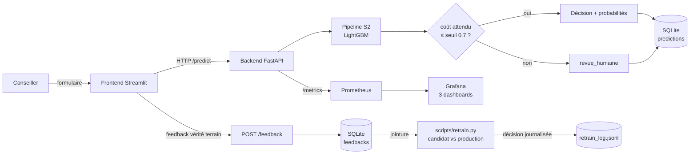

# Dossier de conception — `trajectoire_emploi`

> Public cible : un architecte/relecteur technique qui doit pouvoir reprendre le projet.
---

## 1. Décisions clés du projet

| # | Décision | Statut | Raison |
|---|---|---|---|
| D2 | Retrait de `nationalite_hors_ue` du modèle servi (scénario S2, pas S1) | **Tranchée** | Usage direct d'une variable protégée = risque légal RGPD/non-discrimination indépendant de son effet mesuré, même quand cet effet est statistiquement favorable au groupe protégé (cas de S1) |
| D3 | Valeur du coût de l'erreur 2→0 dans la matrice de coûts (= 10) | **Ouverte** | Hypothèse de travail arbitraire (structure validée, valeur jamais validée avec le métier) |
| D4 | Traitement des 74 lignes à ancienneté incohérente (ancienneté > âge − 15) | **Tranchée** | Valeur neutralisée + flag `anciennete_incoherente` (ni correction arbitraire, ni perte de ligne) |
| D5 | Base légale RGPD pour l'usage de `nationalite_hors_ue` dans l'audit d'équité | **Ouverte** | Nécessite un avis DPO — l'audit a mesuré un effet, pas statué sur la légalité de son usage |
| D6 | Acceptabilité du coût mesuré pour le groupe hors-UE sous S2 (taux 2→0 × 7 vs S1) | **Ouverte** | Retirer la variable sensible ne supprime pas la disparité de besoin, cela déplace le risque (légal → opérationnel) |
| D7 | Durée de rétention de `predictions`/`feedbacks` (incl. `synthese_entretien`, texte libre identifiant) | **Ouverte** | Nécessaire pour le réentraînement, aggrave l'enjeu RGPD de conservation |
| D8 | Biais structurel candidat/production sur `reference_set.csv` (production déjà entraînée dessus) | **Documentée, acceptée** | Toute comparaison future favorise structurellement la production ; corriger exigerait un nouveau jeu arbitre (faute de volume de feedbacks réel) |

Détail et traçabilité complète : `README.md` (section « État d'avancement », chaque étape cite les fiches utilisées et les vérifications réelles effectuées).

---

## 2. Les 5 arbitrages techniques

| Arbitrage | Choix | Raison(s) | Condition de changement d'avis |
|---|---|---|---|
| **ML vs DL** | ML classique (LightGBM, gradient boosting sur arbres) | 2 500 lignes, 9 features tabulaires — un DL exigerait un ordre de grandeur de données en plus pour justifier sa complexité ; le modèle classique atteint F1 macro = 0,722 sur le test scellé, | Si le volume de données passait à 100 000+ lignes et qu'un gain mesuré justifiait la complexité |
| **Zero-shot vs supervisé** | Supervisé | Dataset labellisé disponible (2 500 lignes, cible connue) — un zero-shot n'a de sens qu'en démarrage à froid sans label | Sans objet tant que le label `classe_retour_emploi` est collecté |

**Cohérence archi** : aucune brique GenAI (pas de vector DB, pas d'orchestrateur d'agents, pas d'API LLM).

---

## 3. Architecture finale et sobriété

**Ce qu'on n'a PAS mis** (sobriété) :
- Pas de **vector DB** ni d'**embeddings** — pas de RAG.
- Pas de **message queue** (Kafka/RabbitMQ) — volume de prédictions compatible avec un appel HTTP synchrone (latence p95 mesurée ≈ 95 ms, cf. RUNBOOK).
- Pas de **Kubernetes/orchestrateur de conteneurs** — `docker-compose` suffit pour 4 services (backend, frontend, Prometheus, Grafana), pas de besoin de scaling horizontal démontré.
- Pas de **MLflow Model Registry** en production — `mlflow` sert la traçabilité d'expériences, le modèle servi est un fichier `.joblib` versionné directement, un seul modèle actif à la fois.
- Pas de **cron système** pour le réentraînement — GitHub Actions (`schedule:`) suffit, et ne prétend démontrer que le **mécanisme** du trigger.

---

## 4. Évaluation

| Indicateur | Type | Valeur | Seuil / cible |
|---|---|---|---|
| F1 macro (test scellé) | Métrique modèle | 0,722 | — (référence de comparaison) |
| Recall classe 2 (risque longue durée) | Métrique modèle critique | 0,703 | priorité métier : ne pas manquer un usager à risque |
| Taux d'erreur critique 2→0 | Métrique modèle critique | **0,027** | la pire erreur possible (prive l'usager d'accompagnement) |
| Disparate Impact (prédictions, argmax) | Équité | 0,808 | zone grise (règle des 4/5e ≈ 0,8) — surveillé, pas un verdict en soi |
| Taux de revue humaine (abstention) | Opérationnel | ~17-19 % | arbitrage coût/qualité du seuil 0,7 |
| **KPI business** : dossiers orientés sans revue humaine | Business | ~81-83 % | à comparer au processus actuel (tri 100 % manuel) |
| **KPI business** : usagers à risque correctement détectés (recall classe 2) | Business | 70,3 % | seuil d'acceptabilité à définir avec le métier (D3/D6) |
| **KPI business** : usagers à risque **privés à tort** d'accompagnement (erreur 2→0) | Business | 2,7 % | la pire issue possible — priorité absolue de surveillance |

Détail méthodologique complet (scénarios S1-S4, 6 modèles, validation croisée répétée, test scellé exécuté une seule fois) : notebook `use_case.ipynb` §5-§7, `experiments.md`.

---

## 5. Déploiement & monitoring

| Brique | Statut | Référence |
|---|---|---|
| Conteneurisation (Docker, user non-root, healthcheck) | ✅ | Étape 9 |
| CI/CD (test → évaluation continue → build) | ✅ | Étape 10, `.github/workflows/ci.yml` |
| Traçage d'expériences (MLflow) | ✅ | Étape 11 |
| Monitoring technique (Prometheus + Grafana, 3 dashboards) | ✅ | Étape 13.1-13.3 |
| Détection de dérive (PSI/KS/Chi², démonstration synthétique) | ✅ (démonstration) | Étape 13.4 |
| Garde-fou de non-régression (seuils bloquants CI) | ✅ | Étape 13.5, `scripts/evaluate_model.py` |
| Boucle de feedback conseiller (endpoint + UI + store) | ✅ | Étape 12 |
| Réentraînement gardé (candidat vs production, politique de promotion) | ✅ | Étape 14, `scripts/retrain.py` + `scripts/promotion.py` |
| Trigger de réentraînement automatique sur serveur réel | **démonstration du mécanisme uniquement** | pas de serveur de production persistant pour cet exercice — `retrain.yml` le documente honnêtement |

---

## 6. Conformité & sécurité

### 6.1 Qualification AI Act

**Usage réel** : un classifieur score chaque demandeur d'emploi en 3 classes à l'issue du premier entretien ; la classe « risque de longue durée » déclenche un accompagnement renforcé. **Un humain peut contredire** la décision (seuil d'abstention à 0,7 → revue humaine systématique sur les cas ambigus, ~17-19 % des dossiers).

**Qualification** : ce cas relève très probablement de l'**Annexe III** de l'AI Act — *« accès aux services essentiels »* et/ou *« gestion des travailleurs »* couvrent l'orientation de demandeurs d'emploi par un système automatisé. **Cela correspondrait à un cas HAUT RISQUE**, et non à un simple outil interne sans obligation. Point à faire trancher formellement par un DPO/juriste avant toute mise en production réelle — ce dossier documente l'hypothèse la plus prudente plutôt que de la minimiser.

**Ce qui est positif** : plusieurs obligations typiques du haut risque sont **déjà en place**, pas à construire :
- Supervision humaine effective (seuil d'abstention, pas un simple avertissement).
- Journalisation (logs structurés, store de prédictions).
- Monitoring de dérive (Étape 13.4) et évaluation continue (Étape 13.5).
- Documentation du jeu de données (datasheet Gebru, Étape 2).

**RGPD** : base légale à instruire (D5) — probablement intérêt légitime ou mission de service public selon le statut de l'organisme exploitant, pas acquise d'office. `nationalite_hors_ue` est une donnée sensible à justifier spécifiquement (actuellement exclue du modèle servi — D2 — mais utilisée pour l'audit d'équité, cf. D5). Art. 22 RGPD (décision exclusivement automatisée) : **non applicable tel quel** grâce à la revue humaine sur abstention — à reconfirmer si le taux d'abstention baissait significativement.

### 6.2 Sécurité — surface d'attaque et menaces

Surface exposée : **API d'inférence** (locale, non publique dans cet exercice) + **boucle de feedback** (ouverte, alimentée par des conseillers humains).

| Menace | Plausibilité sur ce cas | Mitigation en place | Risque résiduel |
|---|---|---|---|
| **Data poisoning via la boucle de feedback** | 🟠 plausible — la boucle est ouverte (Étape 12/14), un conseiller malveillant ou négligent pourrait injecter de faux labels | Politique de doublon/contradiction (409 sur label contradictoire), garde-seuil + biais candidat/production documenté (D8) qui limite l'effet d'un petit nombre de feedbacks corrompus | Aucune validation humaine du contenu du feedback lui-même — accepté pour cet exercice |
| **Adversarial examples (entrée manipulée)** | 🟡 faible mais pas nul — un conseiller pourrait tester des valeurs limites pour influencer la décision | Bornes de validation Pydantic sur chaque champ (ex. `age` ∈ [16,70]) | Pas de détection d'entrées statistiquement atypiques en temps réel (couvert partiellement par le monitoring de dérive, en différé) |
| **Extraction de modèle via l'API** | 🟡 faible — API non publique dans cet exercice, pas de rate limiting | — | À traiter avant toute exposition publique (authentification + rate limiting) |
| **Fuite de données d'entraînement** | 🟡 faible — modèle tabulaire, pas de mémorisation de texte libre identifiable démontrée | `synthese_entretien` vectorisé en TF-IDF (pas de génération de texte en sortie) | À surveiller si le modèle évoluait vers une architecture plus complexe (ex. un LLM fine-tuné) |

---

## 7. Coûts

**Méthode** : coût mensuel ≈ volume/mois × coût unitaire + coût fixe d'infra.

| Poste | Estimation | Calcul |
|---|---|---|
| Inférence (modèle ML classique local, CPU) | ~0 €/mois | < 10 ms/requête, CPU négligeable — pas de GPU nécessaire |
| Serveur (API + UI + monitoring, VPS/local) | 10-100 €/mois | 4 conteneurs légers (image backend ≈ 780 Mo), pas de charge lourde démontrée |
| Build initial (développement, Lots 1-3) | ~15-20 jours·homme | 400-900 €/jour·homme → ordre de grandeur 8-15 k€ pour l'industrialisation complète (hors Partie A) |
| Maintenance annuelle | ~10-15 % du build/an | Réentraînement périodique, supervision du monitoring, ajustement des seuils |
| Réentraînement (candidat, par run) | ~quelques secondes CPU | Négligeable — pas de coût GPU, pas d'API LLM facturée à l'appel |

---

## Ce qui reste à trancher (hors scope technique)

Décisions D3, D5, D6, D7 (tableau §1) — nécessitent un arbitrage métier/DPO, pas une solution technique supplémentaire. La qualification AI Act (§6.1) devrait être confirmée formellement avant toute mise en production réelle.
